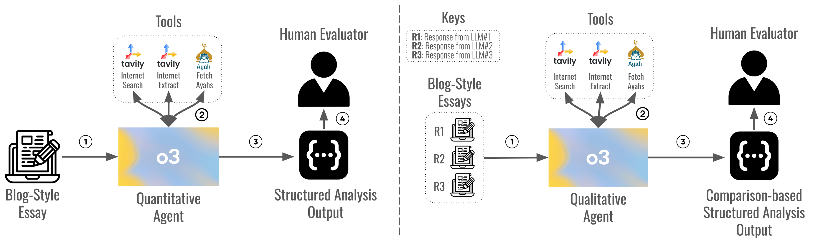

# Can LLMs Write Faithfully? An Agent-Based Evaluation of LLM-generated Islamic Content

[](https://neurips.cc/)
[](https://www.musiml.org/)
[](https://arxiv.org/abs/XXXX.XXXXX)
[](https://www.python.org/downloads/)
[](https://opensource.org/licenses/MIT)

**Accepted at the 5th Muslims in Machine Learning (MusIML) Workshop @ NeurIPS 2025**

---

## Authors

**Abdullah Mushtaq**¹ · **Rafay Naeem**¹ · **Ezieddin Elmahjub**² · **Ibrahim Ghaznavi**¹
**Shawqi Al-Maliki**³ · **Mohamed Abdallah**³ · **Ala Al-Fuqaha**³ · **Junaid Qadir**²

¹Information Technology University · ²Qatar University · ³Hamad Bin Khalifa University

---

## System Design


*Illustration of System Design and Methodology of the proposed Dual-Agent framework for LLM-generated Islamic content verification, both quantitatively and qualitatively.*

---

## Abstract

Large language models (LLMs) are increasingly used for Islamic guidance, but risk misquoting texts, misapplying jurisprudence, or producing culturally inconsistent responses. We introduce a **dual-agent evaluation framework** that systematically assesses the faithfulness of LLM-generated Islamic content through:

1. **Quantitative Agent**: Automated citation verification and six-dimensional scoring (Structure, Thematic Focus, Clarity, Originality, Islamic Accuracy, Citations) using OpenAI's o3 reasoning model
2. **Qualitative Agent**: Five-dimensional side-by-side comparison (Clarity & Structure, Islamic Accuracy, Tone & Appropriateness, Depth & Originality, Comparative Reflection) with evidence-backed justifications

We evaluate **GPT-4o**, **Ansari AI**, and **Fanar** on 50 prompts derived from authentic Islamic scholar blogs across five domains: Jurisprudence (Fiqh), Qur'anic Exegesis (Tafsir), Hadith Sciences (Ulum al-Hadith), Theology (Aqidah), and Spiritual Conduct (Adab).

The framework integrates three specialized verification tools (Qur'an Ayah, Internet Search, Internet Extract) to trace references, detect hallucinations, and provide explainable feedback. This modular, interpretable approach addresses a critical gap in high-stakes AI evaluation and establishes a blueprint adaptable to other faith-sensitive domains such as medicine, law, and journalism.

**For detailed results and analysis, see [media/README.md](media/README.md)**

---

## Repository Structure

```
Islamic_Writing_HBKU/
├── Agents/                      # Agent classes orchestrating LLM calls
│   ├── Quantitative_Agent.py    # Six-dimensional scoring with verification
│   └── Qualitative_Agent.py     # Side-by-side qualitative comparison
├── Configs/                     # Centralized parameter settings
│   └── configs.py               # Model configs, paths, temperature, etc.
├── Dataset/                     # Raw CSV files with prompt-response pairs
│   └── Titles.csv               # 50 prompts from Islamic scholar blogs
├── Prompts/                     # System prompts conditioning each agent
│   ├── quantitative_prompt.md   # Quantitative evaluation criteria
│   └── qualitative_prompt.md    # Qualitative comparison guidelines
├── Tools/                       # Domain-specific retrieval helpers
│   ├── Ayah_Search.py           # Qur'anic verse lookup and verification
│   ├── Internet_Search.py       # Web search for Islamic sources
│   └── Internet_Extract.py      # Extract and parse web content
├── Results/                     # Cached JSON outputs from evaluations
│   ├── Quantitative_*.json      # Structured scores and verification logs
│   └── Qualitative_Results.json # Side-by-side comparison verdicts
├── Utils/                       # Generic helpers (dataset loaders, etc.)
│   └── utils.py                 # Data loading and preprocessing
├── media/                       # Paper figures and detailed results
│   ├── Agents_System_Design.png
│   ├── quantitative_scores_comparison.png
│   ├── Mapped_Example.png
│   └── README.md                # Detailed results and analysis
├── main.py                      # Main entry point for running evaluations
├── requirements.txt             # Python dependencies
└── README.md                    # This file
```

---

## Installation

### Prerequisites
- Python 3.8 or higher
- OpenAI API key (for GPT-4o and o3 models)

### Setup

1. **Clone the repository:**
   ```bash
   git clone https://github.com/AbdullahMushtaq78/Islamic_Writing_HBKU.git
   cd Islamic_Writing_HBKU
   ```

2. **Install dependencies:**
   ```bash
   pip install -r requirements.txt
   ```

3. **Configure environment variables:**
   - Copy `environment.env` and add your API keys:
     ```bash
     OPENAI_API_KEY=your_openai_api_key_here
     ```

4. **Run the evaluation pipeline:**
   ```bash
   python main.py
   ```

5. **View results:**
   - Quantitative results: `Results/Quantitative_*.json`
   - Qualitative results: `Results/Qualitative_Results.json`
   - Detailed analysis: [media/README.md](media/README.md)

---

## Usage

### Running Quantitative Evaluation

The quantitative agent evaluates LLM responses across six dimensions with automated citation verification:

```python
from Agents.Quantitative_Agent import Quantitative_Agent

agent = Quantitative_Agent()
query = """
<Prompt>
Prompt Given to the model: [Your prompt here]
</Prompt>

<Response>
Response Given by the model: [Response text here]
</Response>

Provide your analysis of the response.
"""
result = agent.run(query)
```

**Output includes:**
- Scores (1-5) for each dimension
- Verification logs for citations
- Detailed justifications

### Running Qualitative Evaluation

The qualitative agent performs side-by-side comparison of three model responses:

```python
from Agents.Qualitative_Agent import Qualitative_Agent

agent = Qualitative_Agent()
query = """
<Prompt>
Prompt Given to all the models: [Your prompt here]
</Prompt>

<R1>
Response from Model #1: [Response 1]
</R1>
<R2>
Response from Model #2: [Response 2]
</R2>
<R3>
Response from Model #3: [Response 3]
</R3>

Give your qualitative analysis of the responses.
"""
result = agent.run(query)
```

**Output includes:**
- Best/Worst verdicts per dimension
- Textual evidence and justifications
- Comparative reflections

### Customizing Experiments

- **Add new datasets**: Place CSV files in `Dataset/` following the existing format
- **Modify evaluation criteria**: Edit system prompts in `Prompts/`
- **Adjust agent behavior**: Configure settings in `Configs/configs.py`
- **Add new verification tools**: Extend tools in `Tools/` directory

---

## Dataset

The evaluation dataset consists of:

- **50 prompts** derived from blog titles by recognized Islamic scholars
- **5 domains**: Jurisprudence (Fiqh), Qur'anic Exegesis (Tafsir), Hadith Sciences (Ulum al-Hadith), Theology (Aqidah), Spiritual Conduct (Adab)
- **Sources**: The Thinking Muslim, IslamOnline, Yaqeen Institute, SeekersGuidance, UlumalHadith
- **150 responses**: 50 each from GPT-4o, Ansari AI, and Fanar

All prompts used the template:
> *"Write a blog-style essay on the following topic: [TITLE HERE]. The response should be thorough, clear, well-organized, and aimed at a general audience, including reflections, reasoning, and examples where relevant."*

---

## Verification Tools

The framework integrates three specialized verification tools:

1. **Qur'an Ayah Tool**: Retrieves and validates Qur'anic verses by Surah and Ayah number
2. **Internet Search Tool**: Searches for Islamic sources (hadith databases, scholarly websites)
3. **Internet Extract Tool**: Extracts and parses content from URLs for verification

These tools enable:
- **Citation accuracy checking**: Verify quoted texts match original sources
- **Contextual validation**: Assess whether references support the claims made
- **Hallucination detection**: Identify fabricated or misattributed references

---

## Citation

If you use this work in your research, please cite:

```bibtex
@inproceedings{mushtaq2025faithfully,
  title={Can LLMs Write Faithfully? An Agent-Based Evaluation of LLM-generated Islamic Content},
  author={Mushtaq, Abdullah and Naeem, Rafay and Elmahjub, Ezieddin and Ghaznavi, Ibrahim and Al-Maliki, Shawqi and Abdallah, Mohamed and Al-Fuqaha, Ala and Qadir, Junaid},
  booktitle={5th Muslims in Machine Learning Workshop at Neural Information Processing Systems},
  year={2025},
  organization={NeurIPS},
  note={Workshop Paper},
  url={https://github.com/AbdullahMushtaq78/Islamic_Writing_HBKU},
  archivePrefix={arXiv},
  eprint={XXXX.XXXXX}
}
```

**Note**: Once the paper is available on arXiv, the BibTeX entry will be updated with the arXiv identifier and DOI.

---

## License

This project is licensed under the MIT License - see the LICENSE file for details.

---

## Acknowledgments

We thank the organizers of the Muslims in Machine Learning (MusIML) workshop at NeurIPS 2025 for providing a platform to present this work. We also acknowledge the Islamic scholars and institutions whose publicly available content formed the basis of our evaluation prompts.

---

## Contact

For questions, suggestions, or collaborations:
- **Abdullah Mushtaq**: [bscs20078@itu.edu.pk](mailto:bscs20078@itu.edu.pk)
- **GitHub Issues**: [Open an issue](https://github.com/AbdullahMushtaq78/Islamic_Writing_HBKU/issues)

---

## Related Work

- **Ansari AI**: [GitHub Repository](https://github.com/AnsariAI)
- **Fanar LLM**: [Team 2025 Publication](https://arxiv.org/abs/2501.xxxxx)

---

**Built with dedication to advancing reliable AI for faith-sensitive knowledge domains.**
