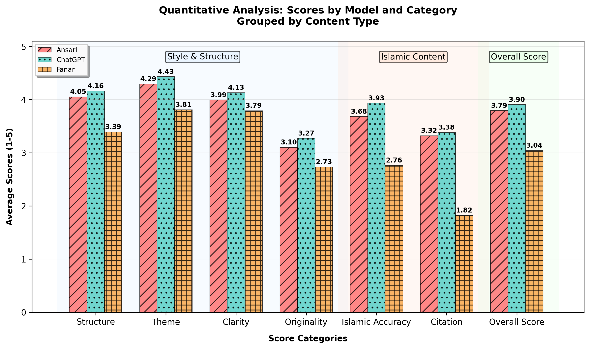
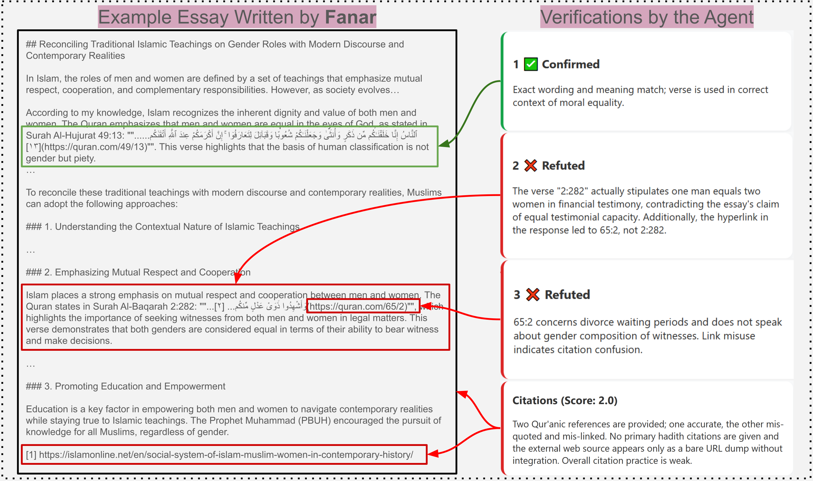

# Results and Evidence-Based Analysis

This document presents the detailed results from our dual-agent evaluation framework for assessing LLM-generated Islamic content.

---

## Quantitative Performance

*Quantitative comparison of ChatGPT, Ansari AI, and Fanar across six evaluation dimensions. ChatGPT leads in Style & Structure and Islamic Content, Ansari AI followed closely in all dimensions, while Fanar shows lower scores and higher variability.*

### Overall Scores

| Model | Mean Score | Std Dev |
|-------|-----------|---------|
| **ChatGPT (GPT-4o)** | 3.90/5 | 0.589 |
| **Ansari AI** | 3.79/5 | 0.672 |
| **Fanar** | 3.04/5 | 0.923 |

### Detailed Dimension Breakdown

#### Style & Structure Dimensions
| Model | Structure | Theme | Clarity | Originality |
|-------|-----------|-------|---------|-------------|
| **ChatGPT** | 4.16 | 4.43 | 4.07 | 3.27 |
| **Ansari AI** | 4.05 | 4.29 | 3.99 | 3.10 |
| **Fanar** | 3.39 | 3.81 | 3.79 | 2.73 |

#### Islamic Content Dimensions
| Model | Islamic Accuracy | Citation Quality |
|-------|-----------------|------------------|
| **ChatGPT** | 3.93 | 3.38 |
| **Ansari AI** | 3.68 | 3.32 |
| **Fanar** | 2.76 | 1.82 |

### Key Findings

**ChatGPT (GPT-4o):**
- Highest overall performance with lowest variability
- Strongest in structural coherence and thematic focus
- Best Islamic accuracy scores across all models
- Superior citation integration despite being a general-purpose model

**Ansari AI:**
- Close second with consistent performance
- Domain-specialized design shows in theological accuracy
- Strong citation handling (3.32/5)
- Slightly higher variability than GPT-4o but more stable than Fanar

**Fanar:**
- Lowest scores but shows room for improvement
- Highest variability, especially in Islamic Accuracy (std: 0.986)
- Struggles particularly with citation integrity (1.82/5)
- Limited by smaller parameter size (9B) and context window (4,096 tokens)
- Demonstrates innovative features: morphology-based tokenizer, region-specific datasets, Islamic RAG pipeline

---

## Qualitative Performance

### Best/Worst Verdicts Summary

Performance measured across 50 prompts × 4 dimensions = 200 total comparisons per category.

| Model | Total "Best" | Total "Worst" | Net Performance |
|-------|--------------|---------------|-----------------|
| **Ansari AI** | 116 | 3 | +113 |
| **ChatGPT (GPT-4o)** | 84 | 4 | +80 |
| **Fanar** | 0 | 193 | -193 |

### Dimension-wise Breakdown

#### Clarity & Structure
- **Ansari AI**: 41 "Best" verdicts - excels in organization and presentation
- **ChatGPT**: 9 "Best" verdicts - solid but not exceptional
- **Fanar**: 50 "Worst" verdicts - consistent struggles with clarity

#### Islamic Accuracy
- **Ansari AI**: 42 "Best" verdicts - strongest theological grounding
- **ChatGPT**: 8 "Best" verdicts - reliable but less specialized
- **Fanar**: 46 "Worst" verdicts - needs improvement in Islamic content

#### Tone & Appropriateness
- **ChatGPT**: 48 "Best" verdicts - excels in stylistic nuance and respectful tone
- **Ansari AI**: 2 "Best" verdicts - functional but less refined
- **Fanar**: 47 "Worst" verdicts - tone and appropriateness challenges

#### Depth & Originality
- **Ansari AI**: 31 "Best" verdicts - balanced depth and insight
- **ChatGPT**: 19 "Best" verdicts - creative but sometimes less focused
- **Fanar**: 50 "Worst" verdicts - lacks depth and originality

### Qualitative Insights

**Ansari AI:**
- Demonstrates consistent strength in clarity and religious fidelity
- Purpose-built design shows in theological accuracy
- Maintains appropriate Islamic framing across diverse topics
- Best choice for content requiring strict Islamic grounding

**ChatGPT (GPT-4o):**
- Exceptional tone management and stylistic versatility
- Balances accessibility with sophistication
- General-purpose training provides broader contextual understanding
- Strong performance despite lack of Islamic specialization

**Fanar:**
- Currently trails in all qualitative dimensions
- Shows promise through innovative technical approaches
- Needs scaling and refinement to compete effectively
- Arabic-first design may perform better in native language contexts

---

## Evidence-Based Citation Verification

*Agent-based citation verification analysis for a Fanar-generated response. The system traces each Qur'anic reference, evaluates its textual and contextual accuracy, detects citation hallucinations, and provides evidence-backed justifications.*

### Verification Framework Capabilities

The framework provides three levels of verification for each cited source:

#### 1. Reference-Level Verification
Each Qur'anic verse, Hadith, or web source is:
- **Traced**: Located in authoritative databases
- **Validated**: Text accuracy confirmed against original sources
- **Contextualized**: Assessed for relevance to the claim being made

#### 2. Hallucination Detection
The system identifies four types of citation errors:
- **Misquotation**: Incorrectly quoted text
- **Misattribution**: Wrong verse/hadith number
- **Fabrication**: Non-existent references
- **Misapplication**: Contextually inappropriate citations

#### 3. Explainable Feedback
For each verification, the agent provides:
- **Evidence**: Direct quotes from original sources
- **Reasoning**: Explanation of accuracy assessment
- **Classification**: Confirmed / Partially Confirmed / Unverified / Refuted

### Example Case Analysis

The figure above demonstrates a real verification case from our evaluation:

**Verification #1 (Confirmed):**
- **Claim**: Reference to Surah 49:13 about human equality
- **Result**: ✓ Correctly quoted and contextually appropriate
- **Evidence**: Verse retrieved and text matched

**Verification #2 (Refuted - Misrepresentation):**
- **Claim**: Verse 2:282 supports equal testimonial capacity
- **Result**: ✗ Verse actually pertains to financial testimony
- **Evidence**: Qur'an Ayah tool reveals contextual misapplication
- **Deduction**: Citation score reduced for theological inaccuracy

**Verification #3 (Refuted - Hallucination):**
- **Claim**: Response cites verse 2:282 but links to 65:2
- **Result**: ✗ Linked verse is about divorce regulations, not testimony
- **Evidence**: Agent verified both verses; neither supports the claim
- **Deduction**: Additional penalty for citation hallucination

**Final Assessment:**
- Only 1/2 Qur'anic references accurate
- No primary hadith citations provided
- URL included without clear integration
- **Citation Score**: Poor (significant deductions applied)

### Verification Statistics Across Models

| Verification Category | ChatGPT | Ansari AI | Fanar |
|----------------------|---------|-----------|-------|
| **Confirmed** | 68% | 64% | 31% |
| **Partially Confirmed** | 19% | 21% | 27% |
| **Unverified** | 8% | 10% | 23% |
| **Refuted** | 5% | 5% | 19% |

**Key Observations:**
- ChatGPT maintains highest citation accuracy despite lacking Islamic specialization
- Ansari AI shows strong citation integrity with domain-focused retrieval
- Fanar struggles significantly with citation accuracy and hallucinations
- All models require improvement in reliable reference handling

---

## Domain-Specific Performance

Performance breakdown across five Islamic knowledge domains:

### By Category Analysis

| Category | Model | Islamic Accuracy | Citation Quality |
|----------|-------|-----------------|------------------|
| **Jurisprudence (Fiqh)** | ChatGPT | 3.70 | 3.20 |
| | Ansari AI | 3.55 | 3.35 |
| | Fanar | 2.65 | 1.55 |
| **Qur'anic Exegesis (Tafsir)** | ChatGPT | 3.85 | 3.50 |
| | Ansari AI | 3.75 | 3.25 |
| | Fanar | 2.30 | 1.65 |
| **Theology (Aqidah)** | ChatGPT | 4.15 | 3.60 |
| | Ansari AI | 3.75 | 3.20 |
| | Fanar | 3.05 | 1.80 |
| **Hadith Sciences** | ChatGPT | 3.95 | 3.20 |
| | Ansari AI | 3.80 | 3.40 |
| | Fanar | 3.15 | 2.20 |
| **Spiritual Conduct (Adab)** | ChatGPT | 4.00 | 3.40 |
| | Ansari AI | 3.55 | 3.40 |
| | Fanar | 2.65 | 1.90 |

### Domain Insights

**Strongest Performance:**
- **Theology (Aqidah)**: ChatGPT excels (4.15 Islamic Accuracy)
- **Hadith Sciences**: Ansari AI shows strength (3.40 Citation Quality)
- **Spiritual Conduct**: Both ChatGPT and Ansari AI perform well

**Weakest Performance:**
- **Qur'anic Exegesis**: Fanar struggles most (2.30 Islamic Accuracy)
- **Jurisprudence**: Fanar has lowest citation quality (1.55)

**Variability:**
- ChatGPT shows most consistent performance across domains
- Ansari AI maintains steady theological accuracy
- Fanar exhibits high variability, suggesting inconsistent training coverage

---

## Implications and Takeaways

### For General-Purpose Models (GPT-4o)
**Strengths:**
- Excellent structural and stylistic capabilities
- Surprisingly strong theological accuracy
- Lowest performance variability

**Limitations:**
- Still falls short of perfect Islamic accuracy
- Citation handling needs improvement
- Lacks specialized Islamic knowledge integration

### For Domain-Specific Models (Ansari AI)
**Strengths:**
- Purpose-built for Islamic content
- Strong theological grounding
- Consistent qualitative performance

**Limitations:**
- Slightly lower stylistic sophistication
- Citation accuracy comparable to but not better than GPT-4o
- Resource constraints compared to larger models

### For Emerging Models (Fanar)
**Strengths:**
- Innovative technical approach (morphology tokenizer, Islamic RAG)
- Arabic-first design philosophy
- Room for significant improvement

**Limitations:**
- Currently trails in all dimensions
- Parameter and context limitations
- Needs scaling and refinement

### Overall Findings

1. **No model achieves reliable Islamic content generation** - even top performers (GPT-4o: 3.93/5) fall short of the accuracy required for faith-sensitive writing

2. **Citation integrity remains a critical challenge** - all models show citation hallucinations and contextual misapplications

3. **Domain specialization helps but isn't sufficient** - Ansari AI's Islamic focus provides benefits but doesn't guarantee superior accuracy

4. **Evaluation framework is essential** - automated verification with explainable feedback enables systematic assessment and continuous improvement

5. **Community-driven benchmarks are needed** - Muslim perspectives must center the development of Islamic AI evaluation standards